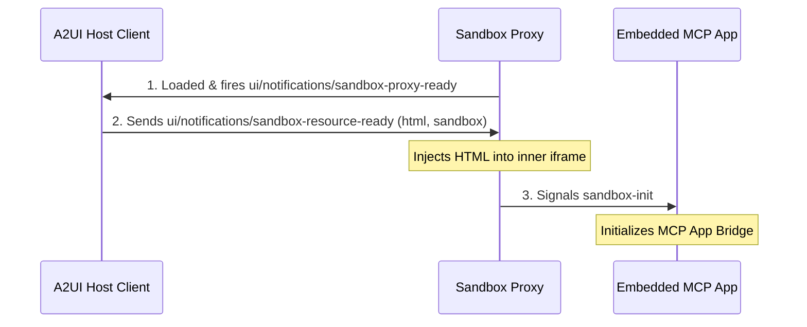
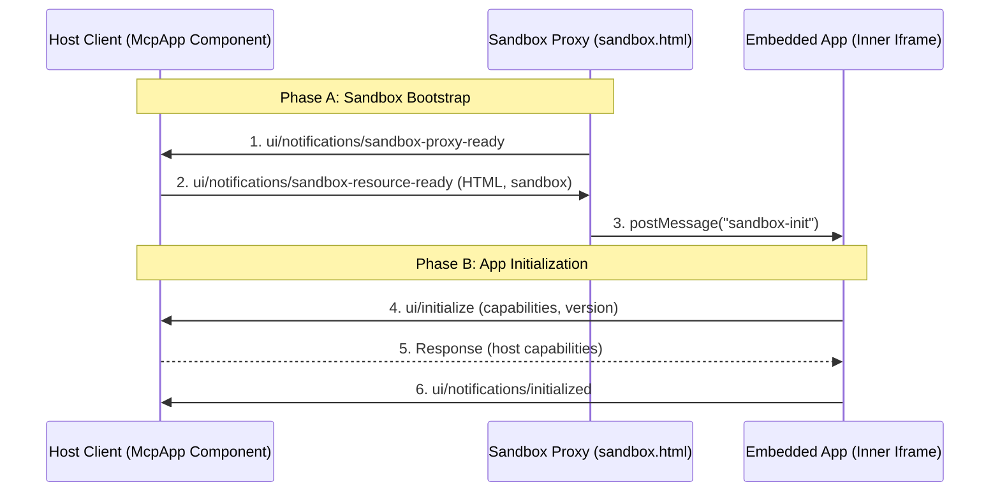

# A2UI MCP App Component Specification (v0.9)

## A Specification for Sandboxed, Model Context Protocol Components in the Agent-to-UI Protocol

Jun 2, 2026  
Status: In progress

# Abstract

This specification defines the A2UI MCP App Component (`McpApp`) for the secure, sandboxed rendering of Model Context Protocol (MCP) applications in the Agent-to-UI (A2UI) protocol. This document has two purposes:

1. **Platform implementation blueprint:** It provides client-side platform developers with instructions to implement compliant `McpApp` components in any native rendering framework (such as Lit or Angular) while maintaining security guarantees.
2. **Interoperable application standard:** It defines the communication interface and message schemas between the A2UI host and the sandboxed MCP application. It uses the `@modelcontextprotocol/ext-apps/app-bridge` specification to support A2UI v0.9 capabilities, including local client-side function execution and two-way local data binding.

# 1. Introduction and motivation

The A2UI protocol is designed to stream structured, type-safe JSON component trees to a client renderer. While A2UI provides standard primitive components like text fields and buttons, complex application use cases often require:

- **Custom layouts:** Displaying rich third-party visualizations, game interfaces, or legacy dashboards.
- **Interactive tools:** Running embedded applications (such as calculators or editors) served directly by remote MCP servers.
- **Strict isolation:** Running untrusted code securely to protect the host application's DOM, session storage, and storage APIs.

The `McpApp` component resolves these needs. It runs the embedded application inside a sandboxed double-iframe proxy using the `@modelcontextprotocol/ext-apps/app-bridge` library.

In A2UI v0.9, the following features are integrated into the MCP App Bridge:

1. **Local client-side function execution:** Allowing the sandboxed application to trigger local host functions (such as system checks or opening links) that are registered in the A2UI catalog.
2. **Two-way local data binding:** Synchronizing state between the MCP application's internal model and the parent A2UI local Data Model without requiring round-trips to the remote agent.

# 2. Architectural overview

Rendering third-party widgets and dashboards requires strict isolation. A2UI uses a double-iframe isolation structure to run untrusted code:

1. **Sandbox proxy (`sandbox.html`)**: An intermediate same-origin frame that hosts the message bridge. It coordinates communication between the A2UI host and the innermost sandboxed application.
2. **Embedded app (Inner iframe)**: The innermost frame that renders the application content. It is sandboxed with `allow-scripts` but without `allow-same-origin` to isolate its storage and origin context.



# 3. The MCP app bridge runtime and communication contract

All communications between the host, the sandbox proxy, and the embedded app use structured JSON-RPC 2.0 messages defined by the `@modelcontextprotocol/ext-apps/app-bridge` specification.

## 3.1. Handshake lifecycle

To establish secure communication across the sandboxed boundaries without race conditions, the handshake is divided into two distinct phases:



---

### Phase A: Sandbox Bootstrap (Aligned to [MCP Apps Specification: Sandbox Proxy](https://github.com/modelcontextprotocol/ext-apps/blob/main/specification/2026-01-26/apps.mdx#sandbox-proxy))

- **Participants:** **Host Client** (the outer `McpApp` component) $\leftrightarrow$ **Sandbox Proxy** (the intermediate `sandbox.html` frame).
- **Implementation Location:**
  - Host-side: Handled by `mcp-app.ts` (`setupSandbox` listening for proxy-ready; `contentUpdate` effect sending resource-ready).
  - Proxy-side: Handled by `sandbox.ts` (listens for resource-ready, sets iframe attributes, sets `srcdoc`, and triggers load).
- **Goal/Achievement:** Decodes, configures, and injects the raw application HTML string into the sandboxed inner iframe under the correct Content Security Policy (CSP) and permissions context before any execution begins.

#### Sequence:

1. **Proxy ready (`ui/notifications/sandbox-proxy-ready`):** Sent from the Sandbox Proxy to the Host once its document has fully loaded and registered its message handler.
   ```json
   {
     "jsonrpc": "2.0",
     "method": "ui/notifications/sandbox-proxy-ready",
     "params": {}
   }
   ```
2. **Resource ready (`ui/notifications/sandbox-resource-ready`):** Sent from the Host to the Sandbox Proxy in response, delivering the application HTML code and sandbox/permission attributes.
   ```json
   {
     "jsonrpc": "2.0",
     "method": "ui/notifications/sandbox-resource-ready",
     "params": {
       "html": "string",
       "sandbox": "string",
       "permissions": ["string"]
     }
   }
   ```
3. **Sandbox initialization (`sandbox-init`):** Sent from the Sandbox Proxy to the Inner Iframe via `postMessage("sandbox-init")` as soon as the inner iframe completes loading the HTML content, signaling that the communication bridge is open.

---

### Phase B: Standard MCP Connection Handshake (Aligned to [MCP Apps Specification: Communication Protocol](https://github.com/modelcontextprotocol/ext-apps/blob/main/specification/2026-01-26/apps.mdx#communication-protocol))

- **Participants:** **Host Client** (via `@modelcontextprotocol/ext-apps/app-bridge`) $\leftrightarrow$ **Embedded App** (the running JS script within the inner iframe).
- **Implementation Location:**
  - Host-side: Evaluated automatically by the `AppBridge` instance initialized in `mcp-app.ts`'s `initializeBridge()`.
  - App-side: Initiated by the application bootstrap script (e.g. `sendRequest('ui/initialize')` and `sendNotification('ui/notifications/initialized')` in `pong_app.html`).
- **Goal/Achievement:** Establishes protocol compatibility, registers display mode capabilities, and activates the JSON-RPC event channel for standard MCP requests and notifications.

#### Sequence:

1. **Initialize request (`ui/initialize`):** Sent from the Embedded App to the Host client to announce its capabilities (e.g. supported display modes, sampling, tool list notifications) and request protocol negotiation.
2. **Initialize response:** Sent from the Host `AppBridge` to the Embedded App, resolving the promise with the host's supported capabilities and platform metadata.
3. **Initialized notification (`ui/notifications/initialized`):** Sent from the Embedded App to the Host to signal that initialization is complete and that it is ready to dispatch outgoing notifications (such as `ui/notifications/size-changed`).

## 3.2. Outgoing messages (Embedded app to host)

### A. Tool call execution (`tools/call`) (Aligned to [Model Context Protocol Specification: Tools](https://github.com/modelcontextprotocol/ext-apps/blob/main/specification/2026-01-26/apps.mdx#standard-mcp-messages))

Dispatched when the embedded application requests an MCP tool execution (representing a user interaction like clicking an action button).

**Message schema**

```json
{
  "jsonrpc": "2.0",
  "method": "tools/call",
  "params": {
    "name": "string",
    "arguments": {
      "key": "value"
    }
  },
  "id": "string-or-number"
}
```

**Host action**  
The host checks if the requested tool name is in the component's `allowedTools` list. If it is authorized, the host dispatches the tool call as an A2UI action to the agent backend. If not, it rejects the tool call and returns a JSON-RPC error response.

### B. Reactive state synchronization (`ui/notifications/data-model-change`)

Dispatched when the embedded application updates its internal state and wants to write it back to the parent A2UI Data Model.

**Message schema**

```json
{
  "jsonrpc": "2.0",
  "method": "ui/notifications/data-model-change",
  "params": {
    "subpath": "string",
    "value": "any-primitive-or-json-object"
  }
}
```

**Host action**  
The host writes the `value` back to the Data Model at the path specified in the component's `data.path` definition.

- If `subpath` (an optional JSON Pointer or key-based path) is provided, the host resolves it relative to the root bound data path (e.g., `dataPath + subpath`) and updates only that specific sub-field.
- If `subpath` is omitted, the host replaces the entire root value at `dataPath`.

To avoid infinite update loops and redundant echoes, both sides should implement cycle prevention:

1. **Host-side Write Lock / Echo Suppression:** When the host processes an incoming `data-model-change` message from the app, it should temporarily set a transaction flag (or write lock) during the write to its local store. The host's data subscription listener should check this flag and suppress sending a loopback `data-model-update` notification to the app for the duration of that synchronous write stack.
2. **Deep-Equality Checking:** The host discards incoming `data-model-change` messages if the value is structurally identical to the current state at the target path, and the embedded app does the same for incoming `ui/notifications/data-model-update` messages to prevent unnecessary redraw cycles.

> [!WARNING]
> Because state propagation is bi-directional over an asynchronous sandbox boundary, race conditions or state clobbering can occur if the host and the embedded app write to the same path concurrently.
> To prevent race conditions, the embedded application and the host SHOULD use targeted subpath updates (via the `subpath` parameter) rather than transmitting full object snapshots. Doing so isolates concurrent updates (e.g., the app updating a score/input field while the host resets state or changes game modes) and prevents them from overwriting each other.

### C. Local client-side function execution (`ui/requests/function-call`)

Dispatched when the embedded app wants to execute a registered local A2UI v0.9 function.

**Message schema**

```json
{
  "jsonrpc": "2.0",
  "method": "ui/requests/function-call",
  "params": {
    "call": "string",
    "args": {
      "argName": "any-value"
    }
  },
  "id": "string-or-number"
}
```

**Host action**  
The host checks if the target function is listed in the component's `allowedFunctions` list. If verified, it evaluates the function using the A2UI client catalog engine and returns the result (or error) to the app.

### D. Frame resize request (`ui/notifications/size-changed`)

Allows the embedded app to dynamically request height or width changes, following standard parameters defined in the [Model Context Protocol Apps Specification: Container Dimensions](https://github.com/modelcontextprotocol/ext-apps/blob/main/specification/2026-01-26/apps.mdx#container-dimensions).

**Message schema**

```json
{
  "jsonrpc": "2.0",
  "method": "ui/notifications/size-changed",
  "params": {
    "width": "number",
    "height": "number"
  }
}
```

**Host action**  
The host updates the dimensions of the wrapper element to match the requested size.

### E. Logging notification (`notifications/message`)

Dispatched when the embedded app publishes diagnostic logging, following standard parameters defined in the [Model Context Protocol Apps Specification](https://github.com/modelcontextprotocol/ext-apps/blob/main/specification/2026-01-26/apps.mdx).

**Message schema**

```json
{
  "jsonrpc": "2.0",
  "method": "notifications/message",
  "params": {
    "level": "string",
    "data": "any"
  }
}
```

**Host action**  
The host logs the diagnostic message to the developer console.

## 3.3. Incoming messages (Host to embedded app)

### A. Reactive state update (`ui/notifications/data-model-update`)

Sent whenever the data bound to the `data.path` updates in the parent A2UI Data Model.

**Message schema**

```json
{
  "jsonrpc": "2.0",
  "method": "ui/notifications/data-model-update",
  "params": {
    "subpath": "string",
    "value": "any-primitive-or-json-object"
  }
}
```

**Embedded app action**  
The embedded app consumes this update and updates its internal state at the specified `subpath` (if provided), or replaces its entire local state (if `subpath` is omitted). Deep-equality checks must be used to prevent circular update loops.

### B. Local function execution output

Sent as a response to a `ui/requests/function-call` request.

**Message schema (success)**

```json
{
  "jsonrpc": "2.0",
  "result": {
    "status": "success",
    "result": "any-value-or-object"
  },
  "id": "string-or-number"
}
```

**Message schema (error)**

```json
{
  "jsonrpc": "2.0",
  "error": {
    "code": "number",
    "message": "string",
    "data": "any"
  },
  "id": "string-or-number"
}
```

**Embedded app action**  
The embedded app processes the result or error based on its own logic.

### C. Resource update (`ui/notifications/sandbox-resource-ready`)

Sent when the application HTML content is modified or updated by the A2UI agent.

**Message schema**

```json
{
  "jsonrpc": "2.0",
  "method": "ui/notifications/sandbox-resource-ready",
  "params": {
    "html": "string",
    "sandbox": "string",
    "permissions": ["string"]
  }
}
```

**Embedded app action**  
The proxy reloads the inner iframe with the updated HTML string.

# 4. Component catalog definition

The `McpApp` component is registered in the A2UI Component Catalog.

## 4.1. Schema definition

```json
{
  "McpApp": {
    "type": "object",
    "description": "Renders a sandboxed Model Context Protocol application using double-iframe isolation.",
    "properties": {
      "id": {
        "$ref": "common_types.json#/$defs/ComponentId"
      },
      "component": {
        "const": "McpApp"
      },
      "htmlContent": {
        "$ref": "common_types.json#/$defs/DynamicString",
        "description": "The raw HTML string to render via srcdoc. Can be URL-encoded."
      },
      "allowedTools": {
        "type": "array",
        "items": {
          "type": "string"
        },
        "description": "The list of MCP tools the embedded application is authorized to request."
      },
      "allowedFunctions": {
        "type": "array",
        "items": {
          "type": "string"
        },
        "description": "The list of local client-side functions the embedded application is authorized to call."
      },
      "data": {
        "$ref": "common_types.json#/$defs/DynamicValue",
        "description": "The A2UI data model path or value bound to this component for reactive state synchronization."
      },
      "title": {
        "$ref": "common_types.json#/$defs/DynamicString",
        "description": "The title attribute for accessibility."
      }
    },
    "required": ["id", "component"],
    "unevaluatedProperties": false
  }
}
```

# 5. Rendering setup and security controls

Running untrusted code requires isolation controls to prevent data access and sandbox escape.

## 5.1. Content decoding

The host receives the `htmlContent` property from the catalog definition:

1. It extracts the raw HTML string.
2. If the string starts with `url_encoded:`, it decodes the content using `decodeURIComponent`.
3. It passes the decoded HTML to the sandbox proxy via `sendSandboxResourceReady`.

## 5.2. Double-iframe sandbox layout

- The inner iframe runs without `allow-same-origin` to isolate its storage.
- The outer proxy matches messages from the parent against the expected parent origin using `document.referrer`.
- The outer proxy validates messages from the inner frame by checking `event.source === inner.contentWindow`.

## 5.3. Security controls and operational guardrails

### Content Security Policy configuration

To prevent the application from sending network requests, the proxy injects a Content Security Policy (CSP) tag into the inner frame document head:

```html
<meta
  http-equiv="Content-Security-Policy"
  content="default-src 'self' 'unsafe-inline' 'unsafe-eval' data:; connect-src 'none';"
/>
```

This blocks connection protocols like fetch, XHR, WebSockets, and Server-Sent Events, forcing all communication to be routed through the `AppBridge` channel to the host.

### Dynamic resizing controls

To prevent layout instability, the host enforces the following rules on `ui/notifications/size-changed` requests (leveraging the [Model Context Protocol Apps Specification: Container Dimensions](https://github.com/modelcontextprotocol/ext-apps/blob/main/specification/2026-01-26/apps.mdx#container-dimensions)):

1. **Clamping:** Height must be clamped between 100px and 2000px; width must be clamped between 200px and 3000px.
2. **Throttling:** Consecutive size changes must be throttled to a maximum of one redraw per 100 milliseconds.
3. **Threshold Gate:** Size changes of less than 5 pixels are ignored.

# 6. Implementation guidelines

For web-based platforms, developers SHOULD reuse the official `@modelcontextprotocol/ext-apps` SDK to handle the host-side bridge and sandbox proxy:

- **Host bridge:** Use `AppBridge` and `PostMessageTransport` from `@modelcontextprotocol/ext-apps/app-bridge`.
- **Sandbox proxy:** Implement the outer sandbox proxy (`sandbox.html`/`sandbox.ts`) in the client application by copying the reference template from the MCP Apps SDK's [examples/basic-host](https://github.com/modelcontextprotocol/ext-apps/tree/main/examples/basic-host) directory.

# References

- MCP Apps in A2UI ([https://a2ui.org/guides/mcp-apps-in-a2ui/](https://a2ui.org/guides/mcp-apps-in-a2ui/))
