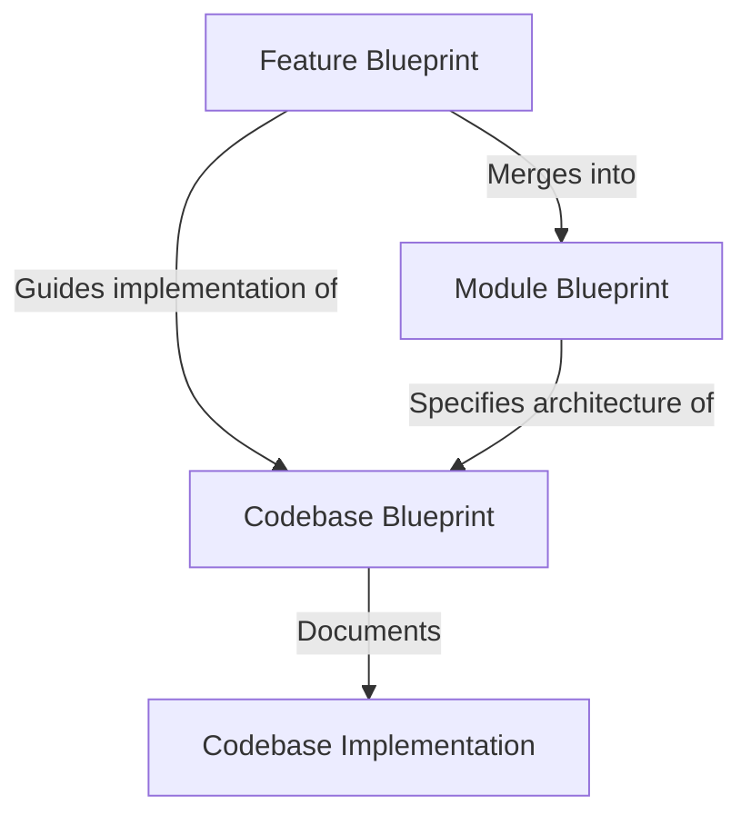

# **Scaling A2UI codebases with spec-driven development**

_Status: Draft_

_Author: Jacob Simionato_

_Created: 2026-06-18 Modified: 2026-06-18_

# **Background**

The A2UI team has adopted recent development practices of using agents to write the majority of our code, using designs, specifications, prompts and other codebases as inputs to guide it. In this paradigm, the job of human developers is primarily to write and maintain the documentation that agents use to write code. This spec-driven development (SDD) approach is being adopted across the software industry in various ways. Members of the A2UI team have tried many different approaches, including generating detailed design docs which are then reviewed by humans for implementation, maintaining markdown guides which can be used to implement multiple variants of a codebase (e.g. `renderer_guide.md` for web renderers) or creating detailed Github issues that are used by agents to implement features.

The A2UI team aims to write and maintain several codebases across multiple languages with a small team. We have an opportunity to do this more efficiently by formalizing our use of spec-driven development, and building shared tooling to help agents follow it smoothly. We can reuse existing approaches to spec-driven development, but adapt them to work with our specific circumstances where we own a family of codebases which implement the same functionality across different languages.

# **Goals**

Adopt spec-driven development with a standardized approach across the A2UI team in service of the following goals:

- Encourage a culture of where we spend more effort creating and reviewing specifications.
- Allow the A2UI team to more quickly implement features across SDK implementations in multiple languages.
- Allow contributors outside of the core A2UI team to more efficiently write and maintain their own A2UI SDKs, for example the Jetpack Composer and Swift UI renderers.
- Allow the A2UI team to collaborate more efficiently by standardizing the way that we record SDK and feature specifications.
- Increase the productivity of agents working in our codebase on any task by giving them better access to relevant design documentation.
- Make it easier for humans and agents to understand the discrepancies between different SDK codebases by emphasizing better definition of features and a clear separation between required features and optional (a.k.a. new or experimental) features.
- Avoid disrupting existing workflows used by team members and ensure they still have freedom to experiment with novel techniques.

# **Overview**

This document outlines the **Spec-Driven Development (SDD)** methodology for the A2UI repository. The goal of SDD is to streamline the implementation of the A2UI protocol and its features across multiple programming languages and UI frameworks by establishing clear, language-agnostic specifications (called **Blueprints**) and leveraging AI coding agents to scale development.



Under this model:

1. **Module Blueprints** define the high-level architecture, core interfaces, and behavior of repository modules (e.g., `a2ui_core`, `a2ui_inference`, `a2ui_react`, etc.).
2. **Feature Blueprints** describe specific feature additions or behavioral changes to a module.
3. **Codebase Blueprints** reside within each platform's implementation folder, tracking implemented features and documenting local design decisions or deviations.

Formal blueprints are primarily used for major features, e.g. the addition of a new public API, behavior, protocol version or architectural change. By having these specifications to be checked into the codebase, we create a natural opportunity for review of feature designs before they are implemented. We also ensure that when we add a feature to one SDK codebase, we can easily port it to other languages.

### **Smaller features**

Smaller features can still be implemented ad-hoc with no formal blueprint. These small feature typically:

- Make changes to functionality that is not explicitly documented in the module blueprint, or
- Address local bugs, refactorings, or performance optimizations that do not affect the public API or cross-language protocol compliance, or
- Add codebase-specific utility functions or internal helpers that do not impact compatibility or consistency with other SDKs.

Specification-driven development is still useful for these features, but the specifications don’t always need to be checked into the file system. They could be checked in as blueprints, or written in Github issues, or exist as temporary files on a developer’s file system.

# **Document types**

## **Feature blueprint**

Feature blueprints describe a _diff_ in functionality that can be implemented in a codebase.

### **Required features**

A **Required Feature Blueprint** describes a feature that has its design merged into all relevant module blueprints. It is expected to be _eventually_ implemented in all codebases for the module. Required feature blueprints are added (or promoted from _optional_ status) _before_ they are implemented in all codebases and there are no guaruntee that the feature is implemented in all codebases within any particular timeframe. It is the job of codebase owners to keep their feature sets as up to date as possible. The codebase blueprints are the source of truth for which features are implemented in each codebase.

- _Agents implementing new codebases_ for a particular module never need to read required feature blueprints. They can completely implement the module and all its required features using only the module blueprint, because it has all the necessary details from existing required feature blueprints.
- _Agents implementing new required features in existing codebases_ primarily use the required feature blueprint to design and implement changes.

### **Optional features**

An **Optional Feature Blueprint** describes a feature that is not baked into the module blueprint and is not expected to be implemented in all codebases. It allows platforms to support experimental or framework-specific features without forcing compliance across all SDKs.

- **Decoupled Lifecycle**: Optional feature blueprints exist as standalone specification files in `blueprints/features/` and are not merged into the base Module Blueprint.
- **Ad-hoc Implementation**: Each codebase can decide independently whether to support an optional feature based on platform capabilities and user needs.
- **Discovery**: Codebases that implement an optional feature must list it in their `codebase.blueprint.md` under `implemented_features` to let clients and agents know it is supported.

### **Feature dependencies**

A feature blueprint can optionally specify a list of **dependencies** in its frontmatter. This list includes other feature blueprints that this feature directly depends on. The purpose of this field is to provide a pragmatic way for coding agents to identify other recent features that might be missing from a codebase and need to be implemented first, rather than being an exhaustive list of all architectural dependencies.

### **my_feature.blueprint.md structure (Example)**

Every feature blueprint must follow a standardized Markdown structure with YAML frontmatter. The feature is named with a date prefix, e.g. `YYYY_MM_DD_feature_name.blueprint.md`, so that if there are many feature blueprints, it's easy to sort them by date and find the most recent and relevant ones. The date in the filename and frontmatter must match, and it is the date that the feature blueprint was initially written.

_(Note: This date is used solely for rough chronological sorting of features. It does **not** indicate any dependency structure—a feature does not necessarily depend on previously created features, nor does it imply it does not depend on features proposed later.)_

Below is an example feature blueprint for a dynamic theming feature, written in a language-agnostic way:

```md
---
feature_name: dynamic_theming
module_blueprints: <!-- The list of modules that this feature affects -->
  - a2ui_core
  - a2ui_react
  - a2ui_lit
  - a2ui_angular
type: optional <!-- Whether this is a 'required' vs 'optional' feature -->
dependencies: <!-- Optional list of direct feature dependencies -->
  - custom_signals
date_added: 2026-06-23
---

# **Dynamic Theming Feature Blueprint**

## **Requirements**

Allow agents or clients to dynamically adjust the visual theme of an active surface without recreating the surface. The client must parse theme updates in the incoming message stream and apply the new styling parameters in real time using common reactivity interfaces.

## **Detailed Description of Changes**

1. **Protocol Schema**: Add an optional `updateTheme` object to the `A2uiMessage` envelope schema.
2. **Message Ingestion**: The `MessageProcessor` must parse the `updateTheme` message
   ...

## **Links**

- RFC/Discussion: [Issue #452](https://github.com/a2ui-project/a2ui/issues/452)
- Protocol Specification: [a2ui_protocol.md](../v1_0/docs/a2ui_protocol.md)

## **Test Cases & Conformance**

- **Test Case 1: Simple Theme Apply**: Verify that sending `updateTheme` with a new background color updates the `theme` signal on `SurfaceModel` and triggers a re-render.
  ...

## **Implementation Steps**

1. Update the `server_to_client.json` schema to include the `updateTheme` envelope.
2. Implement parsing and state propagation in the `a2ui_core` codebase implementations
   ...

## **Checklist**

- [ ] Schema updated and validated
- [ ] `MessageProcessor` parses `updateTheme` and updates `SurfaceModel`
      ...
```

## **Module blueprint**

A **Module Blueprint** describes an entire architectural module in a language-agnostic way. It serves as the primary source of truth for building a new codebase from scratch or verifying the correctness of an existing one.

All _required_ features that affect the module are merged into the module blueprint when the feature is added or promoted, so that new codebases can be implemented using _only_ the module blueprint and without consulting specific feature blueprints. Module blueprints act as a coherent, compacted description of the module, ensuring that the overall module specification does not have unbounded growth over time as features are added. As features are layered on top of each other, it is expected that the module blueprint will find concise ways to describe the overall system which are smaller than a simple concatenation of the feature blueprints.

### **a2ui_core.blueprint.md Structure (Example)**

Every module blueprint must follow a standardized Markdown structure with YAML frontmatter. Below is an example module blueprint for the core state layer (`a2ui_core`):

```md
---
name: a2ui_core
included_features: <!-- The list of "required" feature merged into this module blueprint -->
  - bidirectional_rpc
  - dynamic_binding
---

# **Core State Layer (a2ui_core) Module Blueprint**

## **Architecture Overview**

The core state layer is the framework-agnostic engine of A2UI. It is responsible for parsing inbound JSON streams from the agent, maintaining the active UI surface models, resolving JSON Pointer data bindings, and dispatching client actions back to the transport layer.

## **Core Interfaces**

- **`MessageProcessor`**: The central controller that ingests `A2uiMessage` envelopes and directs updates.
  ...

## **Conformance Test Plan**

Every implementation of `a2ui_core` must pass the core conformance test suite:

- **JSON Parsing Suite**: Validates envelope compliance against `server_to_client.json` and throws `A2uiValidationError` on schema violations.
- **Data Model Binding Suite**: Verifies absolute and relative pointer resolution, type coercion rules, and reactive signal emission.
- **Path to Mock Data**: `specification/v1_0/test/conformance/a2ui_core/`
```

## **Codebase blueprint**

A **Codebase** is a concrete, language-specific or framework-specific implementation of a module. Examples of codebases in this repository include `renderers/web_core` (TypeScript implementation of `a2ui_core`), `renderers/react` (React implementation of `a2ui_react`), and `agent_sdks/kotlin` (Kotlin implementation of `a2ui_inference` and `a2ui_core`).

Every codebase must contain a `codebase.blueprint.md` file in its root directory. This file maps the concrete implementation back to the language-agnostic module blueprint, tracking its feature support and documenting local engineering decisions. The codebase blueprint should be updated _at the same time as the code_ to keep it consistent with the codebase.

### **codebase.blueprint.md Structure (Example)**

Below is an example codebase blueprint for a React renderer codebase (`a2ui_react`):

```
---
associated_module: a2ui_react
implemented_features: <!-- List of fully implemented features in the actual code -->
  - dynamic_theming
  - call_function_rpc
---
# **React Renderer Codebase Blueprint**
## **Architecture & Styling**
This codebase implements the `a2ui_react` module blueprint using React 19 and standard functional components.
* **Reactivity**: We map the core `a2ui_core` state signals to React state via a custom `useSignal` hook to trigger declarative re-renders.
* **Context Propagation**: We use React Context (`ComponentContext.Provider`) to propagate the data binding scopes recursively down the widget tree.
## **Technical Decisions & Overrides**
* **Dynamic Binders**: Unlike static languages, we utilize TypeScript runtime reflection to implement **Generic Binders**. This automatically resolves `DynamicString` properties into static props at the adapter layer, avoiding manual boilerplate for custom components.
* **Event System**: To handle React's synthetic event loop, we throttle input change actions (e.g., `TextField` keystrokes) in the adapter before committing them to the local `DataModel` to optimize performance.
```

# **Developer journeys**

This section explains what steps will be taken by developers and agents to perform common tasks using spec-driven development.

## **Specify a new required feature**

1. Create required feature blueprint **(significant human input required)**
2. Update module blueprint based on the feature blueprint, to ensure the module blueprint fully specifies the feature and how to implement it. Add the feature name to the module’s “included features”. (coding agent)
3. Send PR for review. You can also include an implementation in a codebase in the same PR if you want \- see “Implement an optional or required feature in a codebase”.

## **Specify a new optional feature**

1. Create optional feature blueprint **(significant human input required)**
2. Send PR for review. You can also include an implementation in a codebase in the same PR if you want \- see “Implement an optional or required feature in a codebase”.

## **Promote an optional feature to be required**

1. Update module blueprint based on the feature blueprint, and add it to the module’s “included_features”. (coding agent)
2. Send PR for review.

## **Implement an optional or required feature in a codebase**

1. Verify that the codebase does not already contain the feature
2. Create a temporary design describing in detail how the feature should be implemented in the specific codebase, taking into account the feature blueprint, the codebase blueprint, and the actual codebase code. This file should not be checked in. **(human input required)**
3. Use the temporary design to implement the feature
4. Update the codebase blueprint to add the feature to the "implemented_features" list and include any codebase-specific decisions that were made as part of the feature implementation.
5. Send PR for review.

## **Implement all the features necessary to bring a codebase “up to date”**

1. Read the codebase blueprint and module blueprint and identify all the required features in the module that are not in the codebase.
2. Implement each feature in chronological order, based on their blueprints, following the steps to implement a feature above.
3. Consult the module blueprint and verify that the codebase now matches it, making minor changes to the codebase as necessary to make it as consistent as possible to the module blueprint.
4. Update the codebase blueprint to add the feature to the "implemented_features" list.
5. Send PR for review, either one PR per feature, or one PR for the entire update.

## **Resolve inconsistencies between a module blueprint and all of its associated codebases**

1. Read the relevant module blueprint
2. Search for all codebases that associated with the module
3. Analyse every codebase associated with the module, identifying:
   1. Required features that are missing from each codebase
   2. Discrepancies between the blueprint and the actual implementation e.g. API names or structures which are inconsistent
   3. Discrepancies between the codebases, for which the module blueprint provides no guidance.
4. Report the above and propose actions to take to reduce the inconsistencies including:
   1. Adding additional detail to the blueprints to reduce ambiguity
   2. Update the module blueprint to explicitly mark a detail as being a codebase-level decision
   3. Updating codebases to match the module blueprints
   4. Update the codebase blueprint to document a reason that it has intentionally deviated from the module blueprint for a language-specific reason.
5. Implement some of the proposed actions, based on human discretion **(significant human input required)**
6. Send PR for review.

## **Implement a new codebase**

1. Create a temporary design describing in detail how the codebase should be implemented based on the module blueprint. **(significant human input required)**
2. Implement the module based on the temporary design
3. Create a new codebase blueprint, summarizing the design of details that are not specified in the module blueprint.
4. Split up the changes into manageable chunks to review over several PRs.

## **Clean up feature blueprints**

Feature blueprints undergo a clean, Git-centric lifecycle to prevent the blueprints directory from becoming cluttered with obsolete specifications.

1. **Required Features**: Once a required feature has been fully implemented in all active codebases and its requirements have been integrated into the base Module Blueprint, the feature blueprint file is moved to the archived/ folder.
2. **Optional Features**: Optional feature blueprints remain in `blueprints/features/` as long as they are actively supported. If they are promoted to required, they are integrated into the Module Blueprint and deleted. If they are deprecated or abandoned, they are moved to the archived/ folder.

# **Implementation**

## **Folder structure**

To keep specifications organized and isolated by default, all SDD blueprints, validation tools, and specialized skills reside in the top-level `/blueprints/` directory:

```
/
├── blueprints/
│   ├── README.md                           # Directive instructing agents to ignore folder unless explicitly requested
│   ├── validate_blueprints.py              # Blueprint frontmatter and structure validator
│   ├── link_skills.sh                      # Helper script to symlink blueprint skills into .agents/skills/
│   ├── modules/                            # Language-agnostic Module Blueprints
│   │   ├── a2ui_core.blueprint.md
│   │   └── a2ui_framework_adapter.blueprint.md
│   ├── features/                           # Unmerged / Optional Feature Blueprints (no date prefix)
│   │   ├── dynamic_theming.blueprint.md
│   │   └── archived/                       # Merged / Required Feature Blueprints
│   │       └── bidirectional_rpc.blueprint.md
│   ├── codebases/                          # Codebase Blueprints tracking module compliance by commit hash
│   │   ├── renderers/
│   │   │   └── web_core/
│   │   │       └── codebase.blueprint.md
│   │   └── agent_sdks/
│   │       └── python/
│   │           └── a2ui_core/
│   │               └── codebase.blueprint.md
│   └── skills/                             # SDD Blueprint Skills (isolated from default agent use)
│       ├── a2ui-blueprint-maintenance/
│       ├── a2ui-blueprint-navigator/
│       ├── a2ui-create-feature-blueprint/
│       └── a2ui-implement-feature-from-blueprint/
```

## **Skills**

To support automated execution of spec-driven tasks without cluttering default agent contexts, specialized SDD skills are maintained in `blueprints/skills/`. Developers can optionally symlink them into `.agents/skills/` using `blueprints/link_skills.sh`:

```bash
# Enable SDD skills locally
./blueprints/link_skills.sh

# Remove local SDD symlinks when done
rm -f .agents/skills/a2ui-blueprint-navigator \
      .agents/skills/a2ui-create-feature-blueprint \
      .agents/skills/a2ui-implement-feature-from-blueprint \
      .agents/skills/a2ui-blueprint-maintenance
```

- **`a2ui-blueprint-navigator`**: A read-only analytical guide. It discovers blueprints and inspects codebase compliance against module blueprint git commit hashes (`module_blueprint_commit`).
- **`a2ui-create-feature-blueprint`**: Provides instructions on how to create a feature blueprint inside `blueprints/features/` without date prefixes.
- **`a2ui-implement-feature-from-blueprint`**: Provides instructions on implementing feature specs and updating codebase compliance commit hashes.
- **`a2ui-blueprint-maintenance`**: Manages merging feature specs into Module Blueprints and archiving feature blueprints to `blueprints/features/archived/`.

## **Blueprint validation**

We implement a blueprint validator script (`blueprints/validate_blueprints.py`) that verifies all blueprints conform to required schemas and naming rules. It runs on CI (`.github/workflows/validate_blueprints.yml`) to block submission of invalid blueprints.

The validation script checks:

- **Frontmatter compliance**: Verify all mandatory YAML fields are present and correctly typed.
- **Entity naming rules**: Ensure feature names and module names use snake_case and match their filenames (`feature_name.blueprint.md`).
- **Commit hash & reference integrity**: Validate that `codebase_path`, `associated_module`, optional `module_blueprint_commit`, and `implemented_features` in codebase blueprints point to valid targets.

## **Creation of initial blueprints**

- Module blueprints: We will migrate our existing guides and documentation in the blueprint formats described above. E.g. renderer_guide.md will become the module blueprints for core and framework adapter layers.
- Codebase blueprints: We will have Gemini generate these by analysing the codebases.
